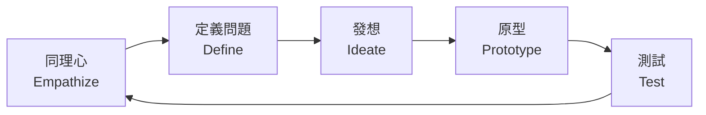

# 🎨 創意思維框架：解鎖無限創新潛能

在快速變化的時代，創意思維已成為個人和組織最重要的競爭優勢。然而，創意並非只是靈光乍現的偶然，而是可以通過系統化的框架來培養和運用的能力。

## 🎯 為什麼需要創意思維框架？

### 突破常見的創意障礙

- **固化思維**：習慣性的思考模式限制了新想法
- **恐懼失敗**：擔心犯錯阻礙了創新嘗試
- **資源限制**：認為創新需要大量資源
- **時間壓力**：快節奏工作讓人沒時間思考

### 系統化框架的優勢

| 優勢 | 說明 | 實際效果 |
|------|------|----------|
| 🎯 **結構化思考** | 提供清晰的步驟指導 | 減少混亂，提高效率 |
| 🔄 **可重複應用** | 標準化流程可反覆使用 | 建立創新習慣 |
| 👥 **團隊協作** | 共同語言促進溝通 | 提升團隊創新力 |
| 📊 **可衡量成果** | 明確的階段性產出 | 追蹤創新進展 |

## 🛠️ 五大核心創意思維框架

### 1. 設計思維 (Design Thinking)

設計思維是最廣泛應用的創新框架，強調以人為中心的解決方案。

#### 五個階段流程



**階段詳解：**

1. **同理心 (Empathize)**
   - 深入了解使用者需求
   - 觀察、訪談、體驗
   - 收集第一手資料

2. **定義問題 (Define)**
   - 分析並綜合觀察結果
   - 明確定義核心問題
   - 建立問題陳述句

3. **發想 (Ideate)**
   - 腦力激盪產生創意
   - 不批判、求數量
   - 建立在前兩階段基礎上

4. **原型 (Prototype)**
   - 快速製作簡單模型
   - 具體化抽象想法
   - 低成本實驗

5. **測試 (Test)**
   - 收集使用者回饋
   - 驗證假設
   - 改進解決方案

### 2. SCAMPER 創意技法

SCAMPER 是一套系統化的創意提問框架，通過七種不同角度激發新想法。

#### 七大提問角度

| 字母 | 英文 | 中文 | 關鍵提問 |
|------|------|------|----------|
| **S** | Substitute | 替代 | 能用什麼替代？ |
| **C** | Combine | 結合 | 能結合什麼元素？ |
| **A** | Adapt | 適應 | 能借鑑什麼經驗？ |
| **M** | Modify/Magnify | 修改/放大 | 能改變或強化什麼？ |
| **P** | Put to other uses | 其他用途 | 還能做什麼用？ |
| **E** | Eliminate | 消除 | 能去掉什麼？ |
| **R** | Reverse/Rearrange | 逆向/重組 | 能顛倒或重新安排嗎？ |

#### 實際應用範例

**以「改善會議效率」為例：**

- **替代**：用視訊會議替代實體會議
- **結合**：結合議程管理工具和即時協作平台
- **適應**：借鑑敏捷開發的站立會議模式
- **修改**：限制每個議題討論時間
- **其他用途**：會議記錄變成知識庫資源
- **消除**：取消不必要的例行會議
- **逆向**：從結論開始倒推討論流程

### 3. 六頂思考帽

由愛德華·德·波諾開發的平行思維工具，幫助團隊從多個角度思考問題。

#### 六種思維模式

🎩 **白帽 - 事實與資訊**
- 客觀數據和事實
- 現有資訊分析
- 缺失資訊識別

🔴 **紅帽 - 情感與直覺**
- 情緒和感受
- 直覺反應
- 無需理由的感覺

⚫ **黑帽 - 謹慎與批判**
- 風險評估
- 潛在問題
- 為什麼不可行

🟡 **黃帽 - 樂觀與正面**
- 優勢和機會
- 正面價值
- 為什麼可行

🟢 **綠帽 - 創意與新想法**
- 創新思維
- 替代方案
- 新的可能性

🔵 **藍帽 - 流程與控制**
- 思考流程管理
- 會議主持
- 總結和下一步

### 4. 創新漏斗模型

系統化管理創意從產生到實現的全流程。

```
創意產生 → 初步篩選 → 概念發展 → 原型測試 → 市場驗證 → 正式推出
   ↓          ↓          ↓          ↓          ↓          ↓
  100個      30個       10個        3個        1個       成功
```

#### 各階段關鍵活動

1. **創意產生階段**
   - 大量創意收集
   - 腦力激盪會議
   - 創意競賽活動

2. **初步篩選階段**
   - 可行性評估
   - 資源需求分析
   - 策略契合度檢查

3. **概念發展階段**
   - 詳細規劃設計
   - 技術可行性研究
   - 市場需求驗證

4. **原型測試階段**
   - 製作最小可行產品
   - 使用者測試
   - 技術驗證

5. **市場驗證階段**
   - 小規模試點
   - 市場反應收集
   - 商業模式驗證

### 5. 創意解決問題流程 (CPS)

結構化的創意問題解決方法，適用於複雜挑戰。

#### 三大階段六個步驟

**🔍 澄清階段**
1. **探索挑戰**：識別機會和問題
2. **表達問題**：明確定義要解決的問題

**💡 發想階段**
3. **探索創意**：產生大量解決方案
4. **表達方向**：評估和選擇最佳創意

**🚀 實施階段**
5. **探索接受度**：分析實施的助力和阻力
6. **表達計畫**：制定詳細行動方案

## 💡 框架選擇與應用指南

### 根據情境選擇框架

| 情境 | 推薦框架 | 適用原因 |
|------|----------|----------|
| 產品創新 | 設計思維 | 以用戶為中心，全流程覆蓋 |
| 改善現有方案 | SCAMPER | 系統化改進現有想法 |
| 團隊決策 | 六頂思考帽 | 避免思維衝突，全面考量 |
| 長期創新管理 | 創新漏斗 | 資源有效配置，風險控制 |
| 複雜問題解決 | CPS | 結構化處理複雜挑戰 |

### 實施成功要素


**成功實施創意框架的關鍵：**

1. **領導支持**：管理層的認同和參與
2. **文化氛圍**：鼓勵實驗和容忍失敗
3. **技能培訓**：團隊成員熟練掌握方法
4. **持續實踐**：定期應用和優化流程
5. **成果追蹤**：衡量和改善創新效果

<div class="notice--info">{{ success-tips | markdownify }}</div>

### 常見實施障礙與解決方案

| 障礙 | 表現 | 解決方案 |
|------|------|----------|
| 時間不足 | 急於求成，跳過步驟 | 從小項目開始，逐步建立習慣 |
| 過度分析 | 停留在理論階段 | 設定時間限制，強制進入行動 |
| 害怕失敗 | 選擇保守方案 | 建立安全實驗環境 |
| 缺乏支持 | 孤軍奮戰 | 找到創新夥伴，建立支持網絡 |

## 🎯 創建個人創意系統

### 日常創意習慣

**🌅 晨間創意時光**
- 每天15分鐘自由寫作
- 記錄夢境和靈感
- 閱讀不同領域資訊

**📝 創意筆記系統**
- 隨身攜帶記錄工具
- 建立創意資料庫
- 定期回顧和整理

**🔄 週期性創意挑戰**
- 每週一個小創新
- 月度創意回顧會
- 季度大挑戰項目

### 環境營造

**物理環境**
- 創意工作角落
- 激發靈感的裝飾
- 創意工具準備

**數位環境**
- 創意軟體工具
- 線上協作平台
- 靈感收集系統

## 🚀 實戰練習與工具

### 入門練習

**30天創意挑戰**

週1-2：**基礎訓練**
- 每天用SCAMPER改善一件日常用品
- 記錄10個觀察到的問題

週3-4：**框架應用**
- 選擇一個真實問題用設計思維解決
- 組織一次六頂思考帽討論

### 推薦工具與資源

**數位工具**
- **Miro/Mural**：視覺化協作
- **Figma**：原型設計
- **Notion**：創意管理
- **MindMeister**：思維導圖

**學習資源**
- 《設計思維》- Tim Brown
- 《創意自信力》- Tom Kelley
- IDEO Design Kit 在線課程
- Stanford d.school 資源

## 🎉 開始您的創意之旅

創意思維框架不是魔法，而是經過驗證的系統方法。關鍵在於：

1. **選擇適合的框架**開始實踐
2. **堅持練習**形成思維習慣
3. **勇於實驗**不怕失敗
4. **持續學習**優化方法


**立即行動建議：**

今天就選擇一個框架，應用到您正面臨的挑戰上。記住，最好的框架是您實際使用的框架！

<div class="notice--warning">{{ call-to-action | markdownify }}</div>

## 🔗 延伸閱讀

- [AI 工具如何增強創意思維](https://justin2061.github.io/idea-hub)
- [創新團隊建設指南](https://justin2061.github.io/idea-hub)
- [數位時代的創意管理](https://justin2061.github.io/idea-hub)

---

*💡 創意無界限，方法有門道。讓我們一起用系統化的方法，釋放內在的無限創意潛能！* 