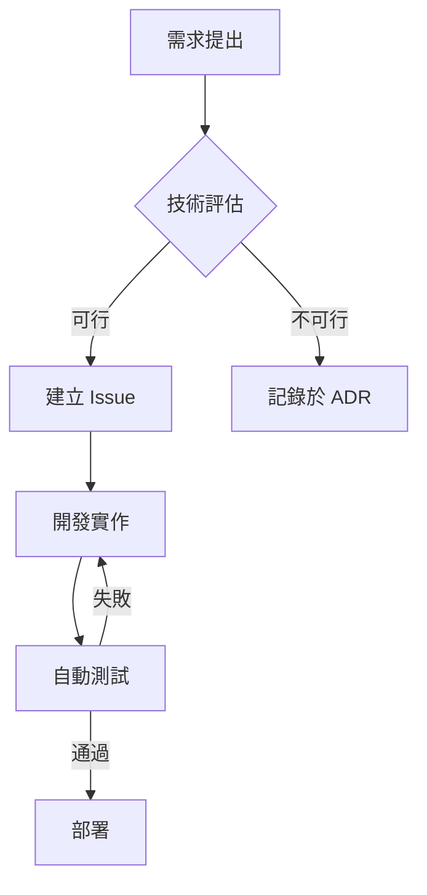

# 開發者生產力革命：從 GitHub 生態系統看軟體開發的效率進化

## 引言：為什麼生產力是當代開發者最重要的課題？

在這個快速變化的科技時代，軟體開發的複雜度正以指數級增長。一個現代應用程式可能需要整合數十個 API、管理複雜的雲端基礎設施、確保安全性與效能，同時還要快速迭代以滿足市場需求。根據 2023 年的開發者調查顯示，超過 67% 的開發者表示「時間不夠用」是他們面臨的最大挑戰。

然而，生產力的提升並不僅僅意味著「做得更快」，而是「做得更聰明」。透過善用現代工具、優化工作流程、建立自動化機制，開發者可以將更多時間投入在真正需要創造力和思考的任務上。本文將以 GitHub 生態系統為核心，深入探討當前生產力領域的最新趨勢與實踐方法，幫助你在 2024 年及未來保持競爭力。🚀

## 核心內容：生產力提升的五大趨勢與實踐

### 1️⃣ AI 輔助編程：從程式碼補全到智慧協作

#### GitHub Copilot 與 AI 編程助手的崛起

AI 輔助編程已經從概念驗證階段進入主流應用。GitHub Copilot、Amazon CodeWhisperer、Tabnine 等工具正在改變開發者的日常工作方式。

**實際影響數據：**

| 指標 | 改善幅度 | 資料來源 |
|------|---------|---------|
| 程式碼撰寫速度 | 提升 55% | GitHub 2023 研究 |
| 重複性任務時間 | 減少 40% | Stack Overflow 調查 |
| 開發者滿意度 | 提高 73% | JetBrains 開發者生態報告 |

**最佳實踐：**

- **善用上下文提示**：在撰寫函數前，先寫清楚的註解說明預期功能，AI 會產生更精準的程式碼
- **迭代式協作**：不要完全依賴 AI 第一次的建議，將其視為起點，逐步優化
- **建立程式碼範本庫**：將常用的程式碼模式儲存為 snippets，結合 AI 建議提高一致性

**案例分享：**

某新創公司導入 GitHub Copilot 後，後端 API 開發時間從平均 3 天縮短至 1.8 天。開發者反饋最大的改變是「不再需要頻繁查詢文件」，尤其在處理不熟悉的第三方函式庫時，AI 能提供即時的使用範例。

### 2️⃣ 自動化工作流程：CI/CD 的深度整合

#### GitHub Actions 與現代 DevOps 實踐

自動化不再是「錦上添花」，而是必要的基礎建設。GitHub Actions 讓開發者能夠直接在程式碼儲存庫中定義完整的自動化流程。

**核心自動化場景：**

1. **持續整合（CI）**
   - 自動執行測試套件
   - 程式碼品質檢查（linting、格式化）
   - 安全性漏洞掃描
   - 建置與打包

2. **持續部署（CD）**
   - 自動部署到測試環境
   - 藍綠部署策略
   - 自動化回滾機制
   - 生產環境監控整合

3. **開發流程自動化**
   - 自動標記 issue
   - PR 自動審查提示
   - 依賴套件自動更新
   - 文件自動生成

**實用 GitHub Actions 工作流程範例：**

```yaml
# 完整的 CI/CD 流程範例
name: 生產力優化工作流程

on:
  push:
    branches: [ main, develop ]
  pull_request:
    branches: [ main ]

jobs:
  quality-check:
    runs-on: ubuntu-latest
    steps:
      - uses: actions/checkout@v3
      - name: 程式碼品質檢查
        run: |
          npm run lint
          npm run format-check
      
  automated-testing:
    needs: quality-check
    runs-on: ubuntu-latest
    steps:
      - name: 執行測試套件
        run: npm run test:coverage
      - name: 上傳覆蓋率報告
        uses: codecov/codecov-action@v3

  security-scan:
    runs-on: ubuntu-latest
    steps:
      - name: 依賴安全掃描
        run: npm audit
      - name: 程式碼安全分析
        uses: github/codeql-action/analyze@v2
```

**效益量化：**

- 人工測試時間減少 80%
- 部署頻率從每週 1 次提升至每日 3-5 次
- 生產環境錯誤率降低 65%

### 3️⃣ 知識管理與文件自動化

#### 讓知識流動起來

生產力的隱形殺手之一是「知識孤島」——重要資訊散落在各處，團隊成員重複解決相同問題。

**現代知識管理策略：**

- **README 驅動開發**：先寫文件，再寫程式碼，確保目標清晰
- **自動生成 API 文件**：使用 Swagger/OpenAPI、JSDoc、TypeDoc 等工具
- **Wiki 與 GitHub Discussions**：建立可搜尋的知識庫
- **ADR（Architecture Decision Records）**：記錄重要技術決策的脈絡

**工具組合建議：**

| 需求 | 推薦工具 | 優勢 |
|------|---------|------|
| API 文件 | Swagger UI、Redoc | 互動式測試介面 |
| 程式碼文件 | TypeDoc、Docusaurus | 版本控制整合 |
| 團隊協作 | GitHub Discussions | 與程式碼緊密結合 |
| 視覺化圖表 | Mermaid.js | Markdown 原生支援 |

**實踐技巧：**

使用 Mermaid 在 Markdown 中直接繪製流程圖：



### 4️⃣ 專注力管理與深度工作

#### 對抗分心，保護創造力時間

現代開發者平均每 11 分鐘就會被打斷一次，而重新進入深度工作狀態需要 23 分鐘。這意味著沒有妥善的專注力管理，真正的生產力時間極為有限。

**GitHub 原生功能的專注力優化：**

1. **通知管理策略**
   - 使用 `CODEOWNERS` 確保只收到相關通知
   - 設定「專注時段」暫停非緊急通知
   - 善用 `Watch` 功能的細緻化設定

2. **批次處理原則**
   - 設定固定時段處理 PR review（例如每天 10:00 和 15:00）
   - 使用 GitHub Projects 的看板視圖集中處理 issues
   - 一次性處理相似類型的任務

3. **環境優化**
   - 使用 GitHub CLI 減少瀏覽器分心
   - 設定專用的開發環境設定檔
   - 利用 Codespaces 快速切換專案環境

**番茄工作法與 GitHub 整合：**

```bash
# 使用 GitHub CLI 的專注工作腳本範例
#!/bin/bash
# focus-session.sh

echo "🍅 開始 25 分鐘專注時段"
gh api user/notifications -X PUT # 標記所有通知為已讀
git fetch origin
git checkout -b feature/focus-work-$(date +%s)

# 25 分鐘計時器
sleep 1500

echo "✅ 專注時段結束，休息 5 分鐘"
gh pr list --assignee @me # 檢查待處理 PR
```

### 5️⃣ 協作效率：遠端團隊的同步與非同步平衡

#### 打造高效能的分散式團隊

遠端工作已成常態，如何在不同時區、不同工作習慣的團隊中保持高生產力？

**非同步協作最佳實踐：**

- **詳細的 PR 描述**：包含背景、變更內容、測試方式、截圖/影片
- **使用 Draft PR**：提早分享進度，獲得方向性回饋
- **錄製程式碼講解影片**：複雜變更搭配 Loom 或 GitHub Codespaces 的分享功能
- **建立 RFC（Request for Comments）流程**：重大變更先討論再實作

**同步協作的黃金時段：**

即使是非同步優先的團隊，也需要同步時間。建議：

- **每日站會（15 分鐘）**：快速同步進度與阻礙
- **每週技術分享（1 小時）**：深度討論技術方案
- **每月回顧會議**：流程優化與團隊建設

**協作效率工具矩陣：**

| 協作類型 | 推薦工具 | 使用時機 |
|---------|---------|---------|
| 程式碼審查 | GitHub PR | 所有程式碼變更 |
| 即時討論 | GitHub Discussions | 技術問題討論 |
| 專案管理 | GitHub Projects | 任務追蹤與規劃 |
| 設計協作 | Figma + GitHub 整合 | UI/UX 與實作同步 |
| 文件協作 | Markdown + PR | 文件版本控制 |

## 實際應用：如何將這些趨勢融入你的日常工作

### 🎯 第一週：建立基礎自動化

**行動清單：**

1. **設定基本 CI/CD 流程**
   - 建立 `.github/workflows/ci.yml`
   - 加入自動測試與程式碼品質檢查
   - 設定分支保護規則

2. **優化通知設定**
   - 檢視目前訂閱的儲存庫
   - 設定 `CODEOWNERS` 檔案
   - 調整通知偏好設定

3. **建立知識庫架構**
   - 撰寫清晰的 README
   - 建立 CONTRIBUTING.md
   - 啟用 GitHub Discussions

### 📈 第二到四週：深化工具使用

**進階實踐：**

- **導入 AI 輔助工具**：試用 GitHub Copilot 或其他 AI 編程助手，記錄效率提升
- **建立自動化腳本庫**：將重複性任務寫成腳本，存放在 `.github/scripts/`
- **實施專注時段**：每天至少安排兩個 90 分鐘的深度工作時段
- **優化 PR 流程**：建立 PR 模板，包含 checklist 確保品質

### 🚀 持續優化：建立回饋循環

**每月檢視指標：**

```markdown
## 生產力指標儀表板

### 開發效率
- [ ] 平均 PR 完成時間：_____ 小時
- [ ] 程式碼審查回應時間：_____ 小時
- [ ] 自動化測試覆蓋率：_____ %

### 品質指標
- [ ] 生產環境 bug 數量：_____
- [ ] 回滾次數：_____
- [ ] 技術債務 issues：_____

### 團隊協作
- [ ] PR 討論品質評分（1-5）：_____
- [ ] 知識分享次數：_____
- [ ] 文件完整度（1-5）：_____
```

**根據數據調整策略：**

- 如果 PR 完成時間過長 → 檢視是否需要拆分更小的任務
- 如果測試覆蓋率不足 → 加入測試相關的 GitHub Actions 檢查
- 如果團隊溝通成本高 → 增加非同步協作工具使用

### 💡 個人化你的生產力系統

每個人的工作風格不同，重要的是找到適合自己的方法：

**晨型人策略：**
- 早上處理需要深度思考的開發任務
- 下午進行程式碼審查與協作
- 使用 GitHub Actions 的排程功能，在早晨自動準備當日任務清單

**夜型人策略：**
- 利用非同步協作優勢，深夜專注開發
- 使用 Draft PR 分享進度，讓其他時區同事接力
- 設定自動化部署在離峰時段執行

## 總結與展望：擁抱變化，持續

---

**參考資料：**
- [探索 生產力 的最新趨勢與實踐](https://github.com)
